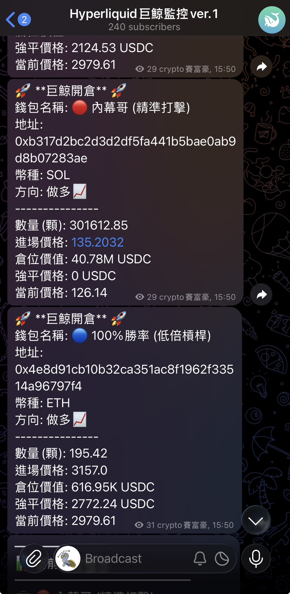
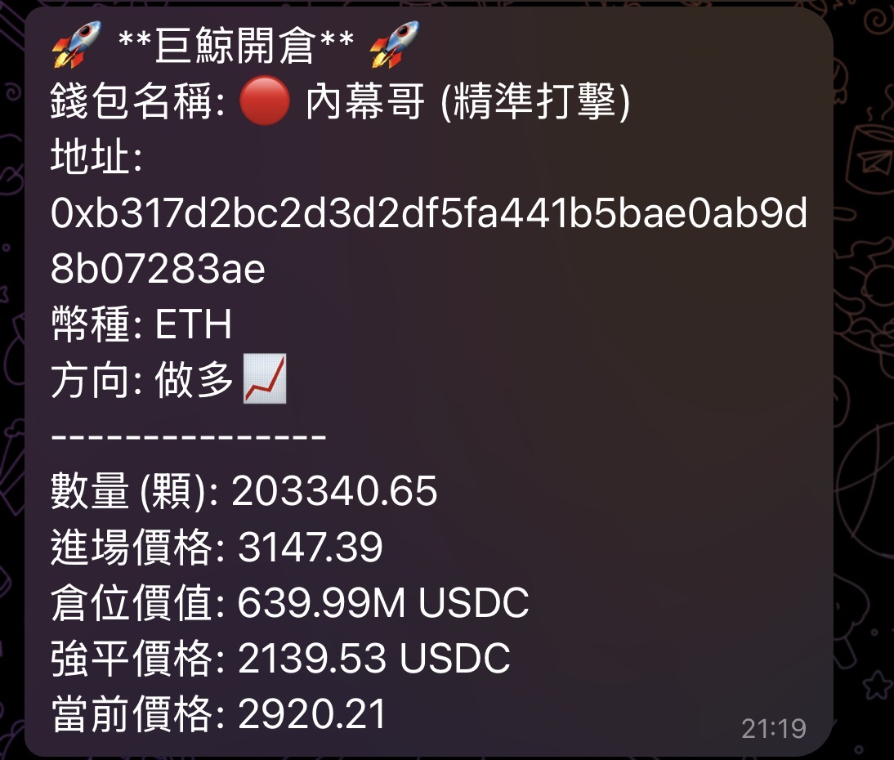
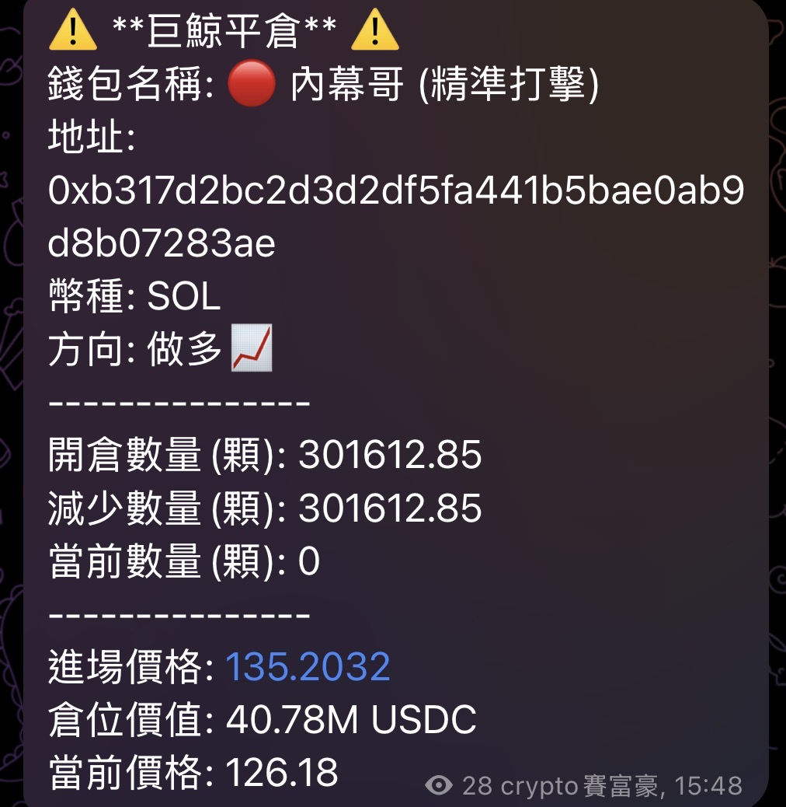
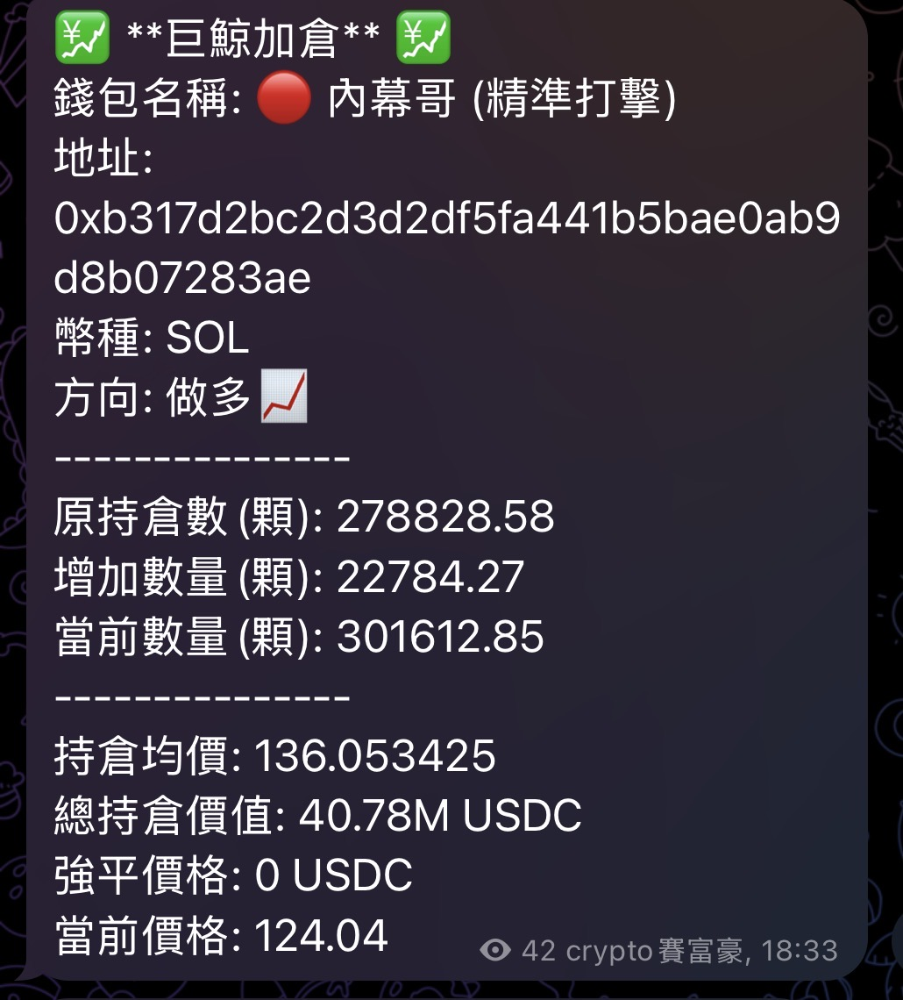
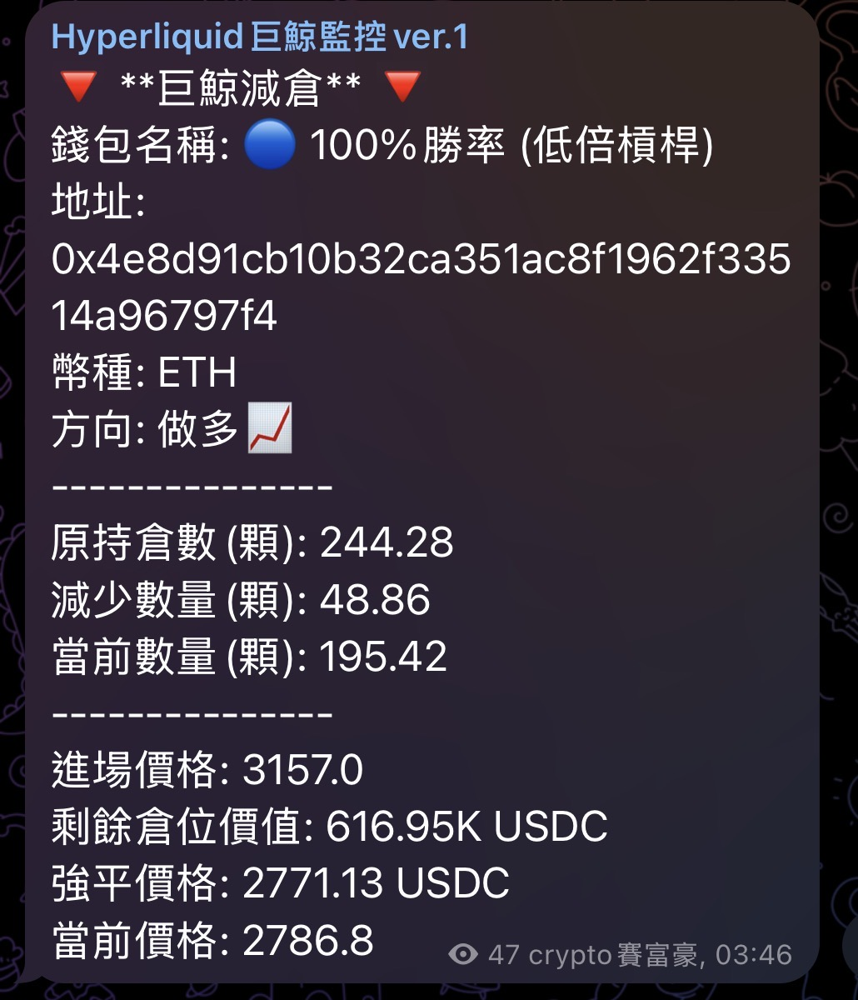
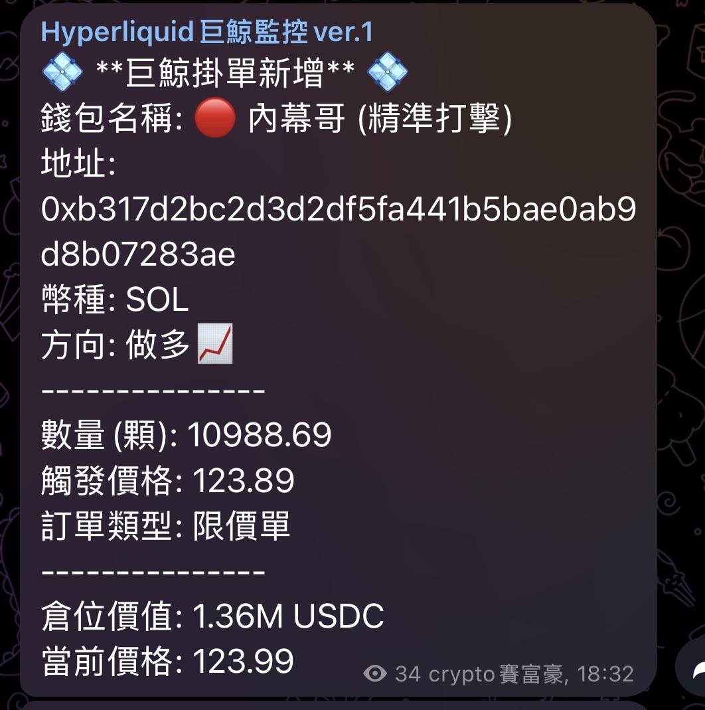
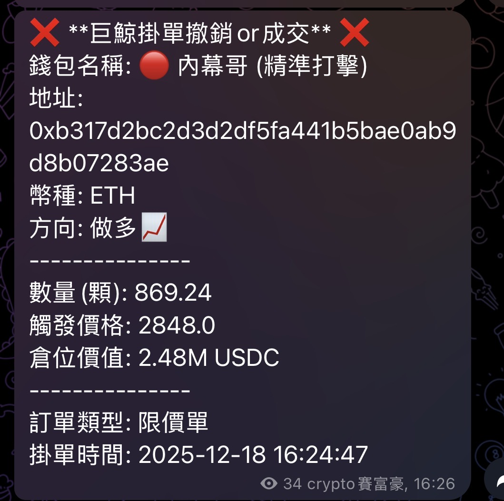

# 巨鯨交易監控系統 (Whale Tracker)

- 這是專門用於監控 Hyperliquid 指定錢包的持倉與掛單變化，並透過 Telegram 發送通知，即時掌握市場動態。

---

## 實際畫面
- 實時監控畫面: 
    <p align="center">
    
    </p>

- #### 開倉相關訊息

    <p align="center">
    
    
    
    
    </p>
- #### 持倉相關訊息

    <p align="center">
    
    
    </p>

---

## 安裝需求
python 套件：

```bash
pip install pandas requests numpy hyperliquid
```

## 使用方式: 主程式

1. 在 config.py 設定：

    - 欲監控的錢包地址 (需在hyperliquid上)
    - Telegram Bot Token 與 Chat ID
    - CSV 檔案路徑（訂單與持倉）

2. 透過**排程**決定多久執行一次主程式： main.py

    - example: 我設定每分鐘檢測一次，確保不會漏看
    - ```python main.py```


3. 主程式會：
    - 取得錢包持倉與掛單資訊
    - 與歷史資料比對
    - 發送 Telegram 通知
    - 更新本地 CSV 檔案


## 使用方式: 工具程式

1. 透過**排程**決定多久執行一次工具程式： send_current_order_position.py

    - example: 我設定每8小時傳送一次當下巨鯨持倉
    - ```python send_current_order_position.py```

2. 工具程式會：
    - 取得錢包當下持倉
    - 發送 Telegram 通知


---

## 專案結構

    address_detector/
    │
    ├─ data/ # 存放當下訂單以及持倉
    │ └─ orders.csv
    │ └─ positions.csv 
    │
    ├─ utils/ # 工具函式
    │ └─ get_kline.py # 取得幣價k線相關資訊
    │ └─ load_csv_data.py # 讀data中的檔案
    │ └─ send_msg.py # 傳telegram 訊息
    │
    ├─ config.py # 全域設定
    ├─ main.py # 主程式
    ├─ orders.py # 處理掛單相關
    ├─ positions.py # 處理持倉相關
    ├─ send_current_order_position.py # 傳送當下持倉
    └─ wallet.py # 與 Hyperliquid API 互動、取得錢包資料


